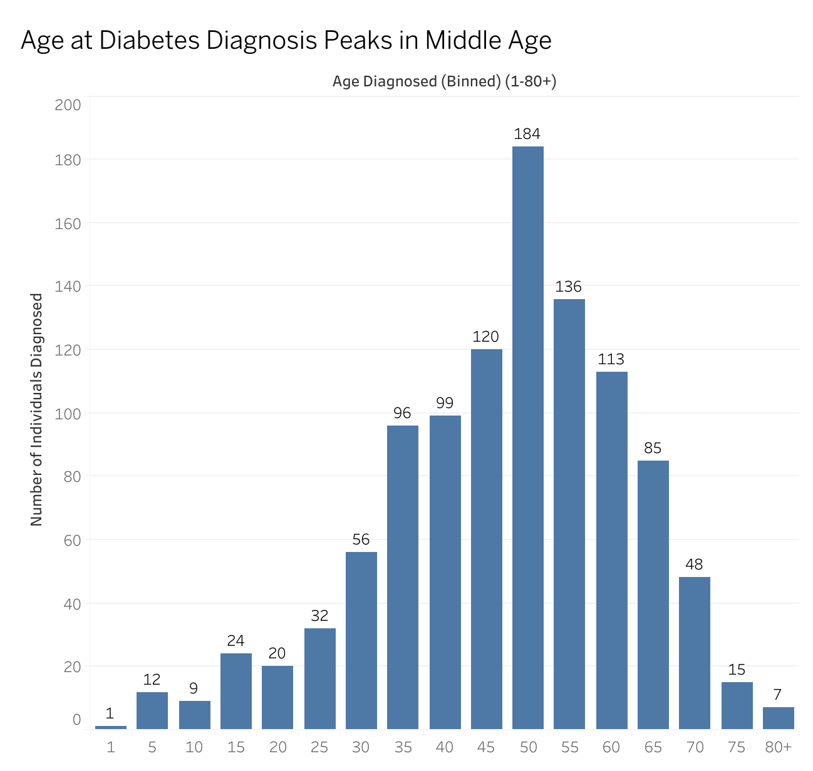
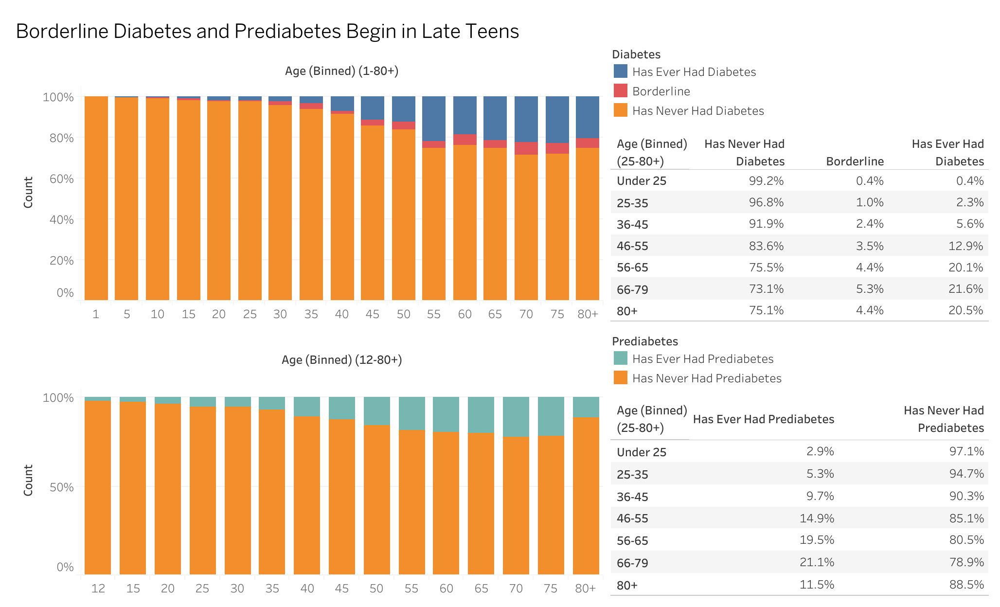
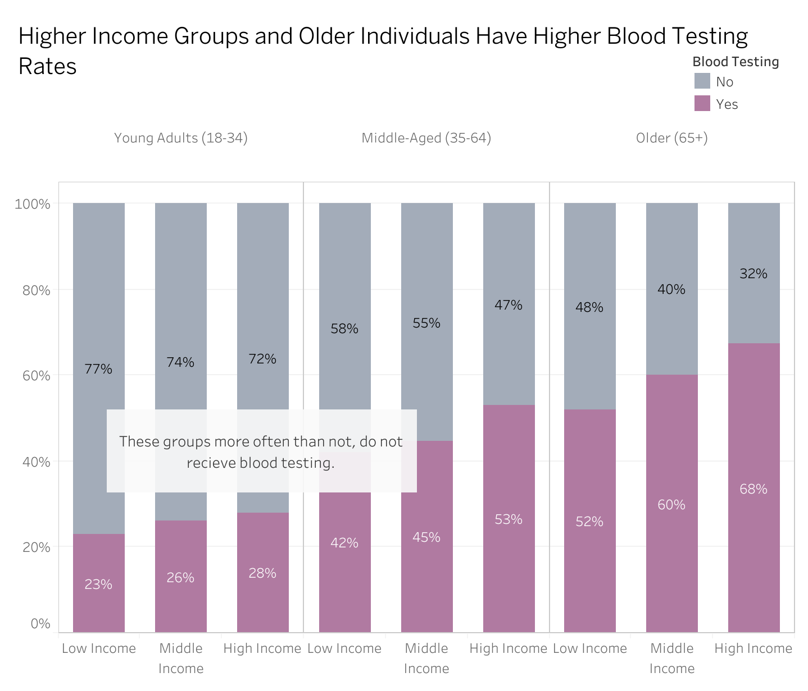
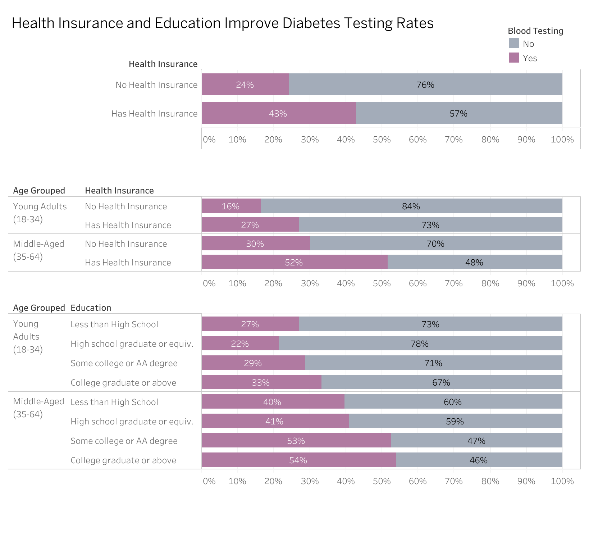
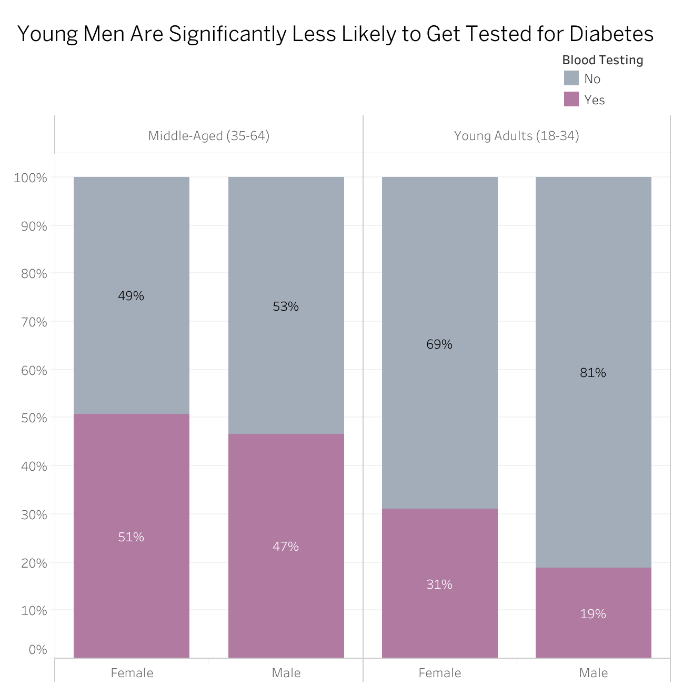
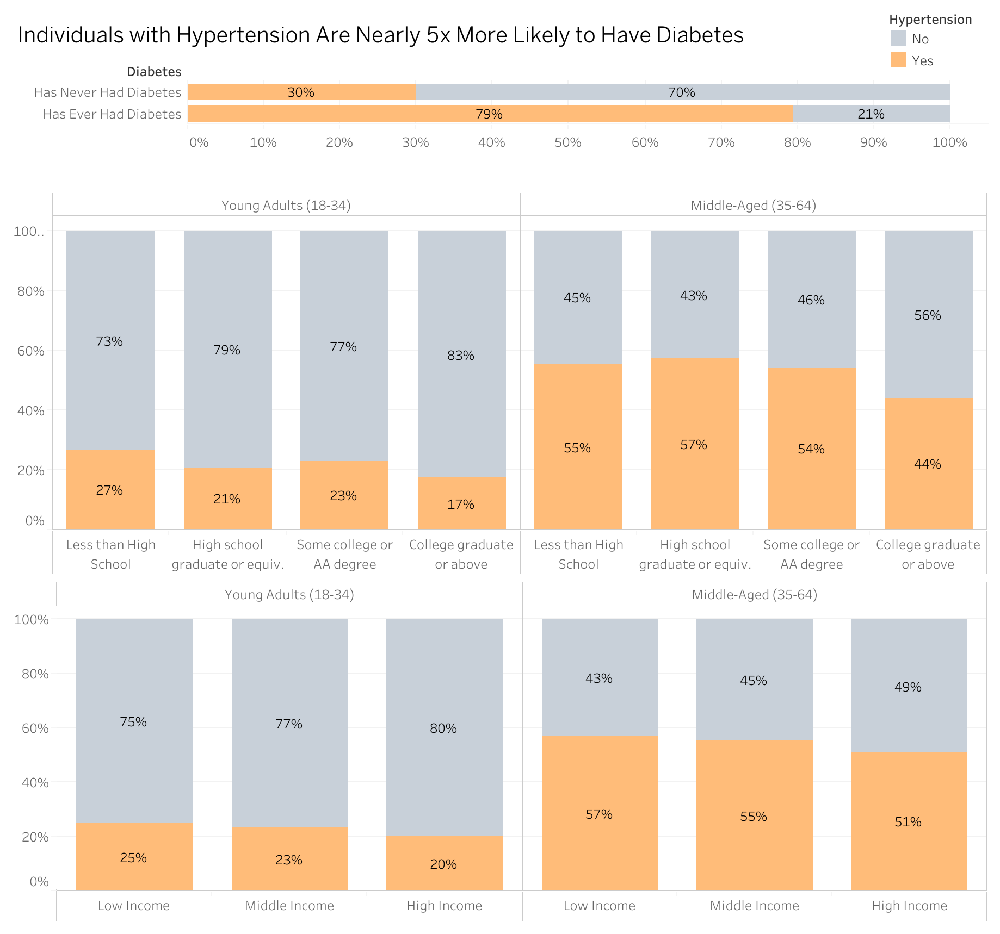

```{r setup_knitr_options, include=FALSE}
knitr::opts_chunk$set(
  echo = FALSE,      
  message = FALSE,   
  warning = FALSE,   
  dpi = 300,         
  fig.align = "center", 
  cache = TRUE     
)
```

# Introduction

This case study analyzes the relationship between diabetes and key demographics, health, and preventative care factors to draw conclusions on the risk of Type 2 Diabetes risk and screening behaviors. The data was accessed from the National Health and Nutrition Examination Survey (NHANES), a publicly available health survey conducted by the Centers for Disease Control and Prevention (CDC). The data spans the period of August 2021 to August 2023 and includes variables such as:

-   Demographics (Age, Income, Education, Race, Gender)

-   Health Factors (BMI, Hypertension, Diabetes Diagnosis)

-   Preventative Care (Blood Testing for Diabetes)

The goal is to **identify trends in diabetes screening and risk factors** to better understand socioeconomic and demographic factors that could influence diabetes prevalence and testing rates..

# Data Collection

The dataset used for this analysis includes the health and demographic information on individuals and can be located using this [link](https://wwwn.cdc.gov/nchs/nhanes/continuousnhanes/default.aspx?Cycle=2021-2023) (CDC, 2024). This data is available as raw `.xpt` files and was downloaded and imported into R. The following pre-processing steps were taken to facilitate this.

## Data Import

The NHANES data files are found across multiple URLs and divided into numerous `.xpt` files, categorized by different components such as Demographics, Examinations, and Laboratory Results. Due to this complexity, a manual download for each would be inefficient. To streamline this, we use web scraping to automate the collection of the files to make this process more efficient. This process consists of:

-   Scraping NHANES data: Using the `rvest` package to extract all available `.xpt` files URLs from the NHANES website.
-   Downloading the files: Save the separated `.xpt` files into a local directory for later processing.
-   Loading the data: Import the downloaded `.xpt` files into R using the `haven` package and combine them into a single data frame for analysis.

```{r libraries_data_import, include=FALSE}

# Load required libraries
library(rvest)        # Web scraping to extract .xpt file URLS from the NHANES website 
library(haven)        # Read .xpt files
```

```{r scrape_and_download_xpt_files, include=FALSE}

# See Appendix A for the full data retrieval steps

# Define NHANES webpage URLs for different data categories
nhanes_urls <- list(
  "Demographics" = "https://wwwn.cdc.gov/nchs/nhanes/search/datapage.aspx?Component=Demographics&Cycle=2021-2023",
  "Examinations" = "https://wwwn.cdc.gov/nchs/nhanes/search/datapage.aspx?Component=Examination&Cycle=2021-2023"
)

# Function to extract .xpt file URLs
get_xpt_urls <- function(url) {
  webpage <- read_html(url)
  xpt_urls <- html_nodes(webpage, 'a') %>% html_attr("href") %>% 
    .[grepl("\\.xpt$", ., ignore.case = TRUE)]

  return(paste0("https://wwwn.cdc.gov", xpt_urls))
}

# Creates directory for .xpt files
dir.create("../data/example", showWarnings = FALSE, recursive = TRUE)

# Function to download .xpt files into the example folder
download_xpt <- function(url, folder = "../data/example") {
  file_name <- basename(url)
  dest_path <- file.path(folder, file_name)
  
  tryCatch({
    download.file(url, dest_path, mode = "wb")
  }, error = function(e) {
    message("Failed to download: ", file_name)
  })
}

# Retrieve .xpt file URLs from NHANES website and downloads them
nhanes_files_example <- unlist(lapply(nhanes_urls, get_xpt_urls)) 
lapply(nhanes_files_example, download_xpt)
```

```{r load_downloaded_xpt_files, include=FALSE}

# See Appendix A for the full data retrieval steps

# Identify all downloaded .xpt files in the example folder
xpt_files_example <- list.files("../data/example", pattern = "\\.xpt$", full.names = TRUE, ignore.case = TRUE)

# Read .xpt files into R as a list of data frames
nhanes_data_example <- lapply(xpt_files_example, read_xpt)

# Assign meaningful names to the data frame
names(nhanes_data_example) <- c("Balance", "Body Measurements", "Blood Pressure", "Demographics", "Liver Ultrasound Transient Elastography")
```

## Data Cleaning & Transformation

The raw NHANES data stored in these `.xpt` files contain a large number of variables, many of which are not needed for this analysis. The following steps were taken to clean and organize the data using the `dyplr` package:

-   Selection of Relevant Variables: Only necessary columns were retained, and datasets were merged using the unique identifier **SEQN**.
-   Renaming for Readability: Raw data values (e.g., 1, 2, etc.) were mapped to their corresponding descriptions using NHANES documentation.
-   Categorization of Variables: Categorical values were converted to factors, and new groupings (e.g., Age and BMI categories) were created to facilitate analysis.
-   Handling Missing Values: Instead of removing rows with missing values, these values were retained to preserve as much data as possible. This ensures that other available information within the same row remains for completeness.

```{r libraries_data_cleaning}

# Load required library
library(dplyr)      # Data cleaning and transformation
```

```{r clean_and_transform_sample_data, include=FALSE}

# See Appendix A for the full cleaning preprocessing steps

cleaned_data_example <- nhanes_data_example$Demographics %>% 
  left_join(nhanes_data_example$`Body Measurements`, by = "SEQN") %>%
  mutate(
    Age_Grouped = cut(RIDAGEYR,
                      breaks = c(0, 18, 35, 65, 100),
                      labels = c("Children & Teens (1-17)", 
                                 "Young Adults (18-34)", 
                                 "Middle-Aged (35-64)", 
                                 "Older (65+)")),
    BMI_Group = cut(BMXBMI,
                    breaks = c(0, 18.5, 25, 30, 35, 40, Inf),
                    labels = c("Underweight", "Normal Weight", "Overweight",
                               "Obesity: Class I", "Obesity: Class II",
                               "Obesity: Class III"),
                    right = FALSE
    )
  ) %>% 
  select(SEQN, Age_Grouped, BMI_Group)
```

```{r preview_cleaned_data, echo=FALSE}
knitr::kable(head(cleaned_data_example), caption = "Preview of the example dataset")
```

# Summary of Findings

The analysis identified disparities in diabetes screening rates based on age, income, and education levels. This impacted the likelihood of individuals undergoing testing, potentially affecting early diagnosis and diabetes prevention efforts. To measure the impact of demographic and socioeconomic factors on diabetes testing behavior, logistic regression models were used. These models estimated the likelihood of undergoing a blood test for diabetes based on predictors such as age, gender, income, education, and health insurance status. The results are reported as odds ratios (OR) and 95% confidence intervals (CI), to help quantify the relative likelihood of testing across these different groups.

The figure below illustrates the age distribution at which individuals reported the age at which they were told they were diagnosed with diabetes. The data shows that most individuals start to become diagnosed with diabetes starting in their mid twenties, which highlights the need for early screening and intervention strategies.

```{r library_knitr_embed, include=FALSE}

# Load required libraries
library(knitr) # Allows to embed images properly
```

```{r fig_age_diagnosis_distribution, fig.pos="H", fig.align="center", out.width="80%", fig.cap="The age at which individuals reported being diagnosed with diabetes. Diagnoses begin in the mid-twenties, increase steadily, and peak between ages 50-55. These findings emphasize the importance of early screening and intervention before middle age to prevent and manage diabetes more effectively."}

```

The next figure shows that individuals show signs of borderline diabetes and prediabetes starting in late teen years and early twenties.

```{r fig_prediabetes_indicators, fig.pos="H", fig.align="center", out.width="90%", fig.cap="Signs of borderline diabetes and prediabetes begin in the late teens and early twenties. Since prediabetes precedes Type 2 Diabetes, screening and lifestyle interventions should be prioritized for younger populations to mitigate future risks."}

```

Based on these findings further analysis focuses on young adults and middle-aged groups to explore disparities in greater depth. Key findings reveal that younger adults, individuals with lower income, and those without health insurance are significantly less likely to undergo blood testing for diabetes. Additionally, gender disparities and hypertension are strongly associated with diabetes risk. Below, we examine each of these findings in detail.

Younger adults are the least likely to get tested. Potential reasons include financial constraints, lack of awareness, and limited healthcare access. This disparity suggests a need for targeted outreach programs focused on younger demographics. The rest of this analysis excludes the older group to further look at the lack of testing for the rest of these individuals.

```{r fig_testing_by_age_income, fig.pos="H", fig.align="center", out.width="70%", fig.cap="This visual demonstrates that younger adults and lower-income individuals have significantly lower blood testing rates, suggesting key barriers to healthcare access in these groups. Young Adults (18-34) are 62.7% less likely to test than Middle-Aged Adults (OR = 0.373, 95% CI: [0.324, 0.427], p < 1.25e-44). Low-Income individuals are 32.2% less likely to test than High-Income (OR = 0.678, 95% CI: [0.585 , 0.786], p < 2.81e-7). Middle-Income individuals are 22.4% less likely to test than High-Income individuals (OR = 0.776, 95% CI: [0.637, 0.944], p = 1.15e-2). These findings highlight critical disparities in access to preventive care."}

```

Several factors influence blood testing rates. Health insurance plays a vital role in diabetes testing. Individuals without health insurance are less likely to undergo testing, emphasizing the role of expanding healthcare coverage and promoting free or low-cost testing programs. Insured young adults often do not undergo testing. While access to healthcare insurance improves access, other factors can also play a role such as inconsistent healthcare visits, lack of physician recommendations, or a limited awareness contributes to lowered testing rates. This suggests education and a more proactive engagement with a physician are necessary elements to include, alongside healthcare coverage. Education level influences testing behavior such that individuals with a higher education correlate to higher rates of testing. Health literacy influences health care behaviors suggesting the need to target lower-education individuals.

```{r fig_testing_by_insurance_education, fig.pos="H", fig.align="center", out.width="80%", fig.cap="Health insurance significantly increases diabetes testing rates. Insured individuals are 76% more likely to test than uninsured individuals (RR = 1.76, 95% CI: [1.52, 2.03], p < 2.22e-16). Young Adults are 64% less likely to test than Middle-Aged Adults (OR = 0.360, 95% CI: [0.316, 0.409], p < 7.10e-55). Individuals with health insurance are 127% more likely to get tested compared to uninsured individuals (OR = 2.27, 95% CI: [1.87, 2.78], p < 3.92e-16). College Graduates are 68% more likely to get tested compared to those with less than a high school education (OR = 1.68, 95% CI: [1.37, 2.07], p < 1.03e- 6). Some College/AA Degree individuals are 52% more likely to test than those with less than a high school education (OR = 1.52, 95% CI: [1.23, 1.88], p < 1.13e-4). High school graduates do not test significantly more than those with less than a high school education (p = 0.807). These results reinforce the importance of expanding healthcare coverage and health literacy programs."}

```

While socioeconomic factors strongly influence testing rates, gender disparities also play a critical role. Gender disparities in testing rates are strongly evident in younger adults. Specifically, young men are 38.9% less likely to undergo blood testing than young women, indicating a need for gender-targeted awareness campaigns.

```{r fig_gender_testing_disparity, fig.pos="H", fig.align="center", out.width="60%", fig.cap="A disparity in blood testing rates across gender is shown here, where young men are significantly less likely to be tested than women, emphasizing the need for targeted outreach to this demographic. Among Young Adults, Males are 38.9% less likely to undergo blood testing than Females (OR = 0.611, 95% CI: [0.469, 0.794], p < 2.42e-4). These findings suggest the need for gender-specific awareness campaigns encouraging early diabetes screening in men."}

```

In addition to demographic disparities, we find strong associations between hypertension and diabetes, highlighting another crucial risk factor.

```{r fig_hypertension_diabetes, fig.pos="H", fig.align="center", out.width="80%", fig.cap="Hypertensive individuals are nearly 4.98 times more likely to have Diabetes than those without Hypertension (RR = 4.98, 95% CI: [4.08, 6.07], p < 2.22e-16). College Graduates are 37.4% less likely to have Hypertension than those with less than a High School education (OR = 0.626, 95% CI: [0.518, 0.757], p < 1.32e- 6). Low-Income individuals are 27% more likely to have Hypertension than High-Income individuals (OR = 1.27, 95% CI: [1.10, 1.46], p = 0.0008). These results suggest that managing hypertension could be an important strategy in preventing diabetes."}

```

These findings reinforce the importance of targeted interventions, policy changes, and educational outreach to address disparities in diabetes testing and prevention. Future studies should explore additional behavioral and systemic barriers that may further contribute to these trends.

# Implications and Recommendations

With these finding, the follow recommendations can be given:

-   There is a need for increased public outreach and awareness. Young adults and lower income individuals need targeted health campaigns emphasizing the importance of early testing. Modern tools such as social media, mobile health apps, and digital healthcare platforms can effectively reach younger populations and improve engagement.

-   Expand access to preventative care and community-based testing programs: Low-income communities should have access to free or reduced-cost screenings, particularly for uninsured individuals. Mobile clinics and community health programs can help bridge healthcare access gaps.

-   Enhance access to primary care providers and telehealth services: Many young adults and low-income individuals may lack a regular primary care provider. Telehealth platforms should be expanded to facilitate virtual consultations and provide convenient options for ordering blood tests at nearby clinics or hospitals.

# Interactive Dashboard

To explore the data interactively, visit the Tableau dashboard:\
[Interactive Tableau Dashboard – Diabetes Case Study](https://public.tableau.com/app/profile/jesus.torres.carbajal/viz/Diabetes_Case_Study/AgeDistributionofDiabetesDiagnoses?publish=yes)

# Limitations and Future Work

While this analysis provides valuable insights into disparities in diabetes screening, several limitations must be acknowledged. The NHANES dataset relies on self-reported responses, which may introduce recall bias and affect data accuracy. Additionally, selection bias exists as higher income individuals are over represented compared to lower-income groups, potentially limiting the generalization of these findings. The sample size also restricted deeper racial and ethnic subgroup analyses, making it difficult to assess disparities in underrepresented populations. Furthermore, missing data required filtering, reducing the dataset size and possibly influencing statistical significance. Finally, as a cross-sectional dataset, NHANES captures data at a single point in time, preventing the establishment of causal relationships or tracking trends over time. Future research should focus on longitudinal studies, expanding data collection efforts to include diverse racial, ethnic, and socioeconomic groups, and developing targeted interventions to improve healthcare accessibility and address systemic disparities in diabetes prevention and diagnosis.

# Appendix A : Full Data Cleaning Code

This appendix provides a complete overview of the data collection and preprocessing steps used in this analysis. The data was obtained from NHANES, cleaned, and transformed for consistency and usability. Below are the key steps involved.

-   Automated Data Collection: Scrape NHANES `.xpt` files directly from the CDC website using `rvest`. Download and store these files in a structured format.
-   Merging and Cleaning: Merged demographic, health, and laboratory datasets based on unique IDs (SEQN). Re-coded categorical variables for better readability according to NHANES documentation. Created age groups, BMI categories, and hypertension indicators.
-   Handling Missing Data: Retained as much valid data as possible while filtering incomplete values. Standardized income, education, and health insurance fields for individuals who lacked a response for every field.

## Load Required Libraries

The following R packages are required to scrape, load, and clean the NHANES dataset.

```{r appendix_libraries_data_import, echo=TRUE}
library(rvest)        # Web scraping to extract .xpt file URLS from the NHANES website 
library(haven)        # Read .xpt files
library(dplyr)        # Data cleaning and transformation
```

## Automated Data Collection: Scraping and Importing NHANES Data

The NHANES dataset is spread across multiple `.xpt` files hosted on the CDC website. The script below automates downloading and importing these datasets. The steps taken are as follows:

-   Define NHANES URLs for different data categories.
-   Extract links to `.xpt` files
-   Download the files into the raw data folder.
-   Read all files into R as a `tibble`.
-   Apply meaningful names as headers to this dataset.

```{r appendix_scrape_import, echo = knitr::is_html_output()}

# Define NHANES data URLs (2021-2023 cycle)
nhanes_urls <- list(
  "Demographics"  = "https://wwwn.cdc.gov/nchs/nhanes/search/datapage.aspx?Component=Demographics&Cycle=2021-2023",
  "Examination"   = "https://wwwn.cdc.gov/nchs/nhanes/search/datapage.aspx?Component=Examination&Cycle=2021-2023",
  "Laboratory"    = "https://wwwn.cdc.gov/nchs/nhanes/search/datapage.aspx?Component=Laboratory&Cycle=2021-2023",
  "Questionnaire" = "https://wwwn.cdc.gov/nchs/nhanes/search/datapage.aspx?Component=Questionnaire&Cycle=2021-2023"
)

# Initialize an empty list to store dataset headers (used for mapping file descriptions)
dataset_headers <- list()

# Defines a function to get links to all .xpt data files
get_xpt_urls <- function(url) {
  webpage <- read_html(url) # Load the webpage
  
  # Extract all hyperlinks and filter for .xpt files
  xpt_urls <- html_nodes(webpage, 'a') %>% html_attr("href") %>%
    .[grepl("\\.xpt$", ., ignore.case = TRUE)]
  
  # Append the NHANES base URL to the extracted .xpt file paths
  base_url <- "https://wwwn.cdc.gov"
  xpt_urls <- paste0(base_url, xpt_urls)
  
  
  # Extract dataset descriptions and assign corresponding codenames
  descr_names <- html_nodes(webpage, 'td:nth-child(1)') %>% html_text(trim = TRUE)
  code_names  <- html_nodes(webpage, 'td:nth-child(2)') %>% html_text(trim = TRUE) %>%
    sub(' Doc', '', .)  # Remove "Doc" from the dataset codes
  
  dataset_headers <<- c(dataset_headers, setNames(descr_names, code_names))
  
  return(xpt_urls)  # Return list of full .xpt file URLs
}

# Create a raw data folder in the working directory (if not already present)
dir.create("../data/raw", showWarnings = FALSE, recursive = TRUE)

# Function to download .xpt files into the raw data folder. If the .xpt files already exists, skips file.
download_xpt <- function(url, folder = "../data/raw") {
  file_name <- basename(url)  # Extract file name from URL
  dest_path <- file.path(folder, file_name)  # Define full path for saving file
  
  if(!file.exists(dest_path)) {
    tryCatch({
    download.file(url, dest_path, mode = "wb")
      }, error = function(e) {
    message("Failed to download: ", file_name)
      })
    }
  }

# Retrieve .xpt file URLs from NHANES website and downloads them
nhanes_files <- unlist(lapply(nhanes_urls, get_xpt_urls))  # Flatten list of URLs
invisible(lapply(nhanes_files, download_xpt))  # Quitely download each .xpt file

# Identify all downloaded .xpt files in the raw data folder
xpt_files <- list.files("../data/raw", pattern = "\\.xpt$", full.names = TRUE, ignore.case = TRUE)

# Read .xpt files into R as a list of data frames
nhanes_data <- lapply(xpt_files, read_xpt)

# Assign short code names (without file extensions) to NHANES datasets
nhanes_data <- setNames(nhanes_data, tools::file_path_sans_ext(basename(xpt_files)))

# Map each dataset's code name to its corresponding descriptive name from dataset_headers
nhanes_data <- setNames(nhanes_data, dataset_headers[names(nhanes_data)])
```

## Cleaning and Transforming the NHANES Dataset

Once imported, the data must be cleaned and formatted for usability. The following steps were taken:

-   Merged datasets based on SEQN, a unique identifier for each participant.
-   Re-coded categorical variables (e.g., education, gender, race) based on NHANES documentation.
-   Created grouped variables for:
    -   Age Grouped: Split into categories representing youth (1–17), young adults (18–34), middle-aged adults (35–64), and older adults (65+).
    -   BMI Group: Categorized based on CDC cutoffs: underweight (\<18.5), normal (18.5–24.9), overweight (25–29.9), and three classes of obesity (30+).
    -   Income: Grouped into low, middle, and high income based on the federal poverty index. Income categories were derived from the Monthly Poverty Level Index, where values ≤1.30 represent low income, 1.30–1.85 represent middle income, and values \>1.85 represent higher income.
-   Defined health-related factors:
    -   Age Diagnosed: Self-reported age when a doctor or other health professional first told to have had diabetes or sugar diabetes
    -   Blood Testing: Defined as having had a blood test for diabetes within the past three years.
    -   Diabetes and Prediabetes: Based on self-reported diagnosis and follow-up questions.
    -   Hypertension: Defined as having high blood pressure if a participant (1) self-reports it, (2) takes medication for it, or (3) has average systolic ≥130 or diastolic ≥80 mmHg.
-   Handled missing or unusable data using `NA` to ensure consistency and completeness across variables.

```{r appendix_cleaning_transformations, echo = knitr::is_html_output()}
# Appendix: Full Data Cleaning Code
# This section contains the full preprocessing steps used in this analysis.

# Picking data with vulnerable groups and adding descriptive values,
# Unusable values are changed to NAs
cleaned_data <- nhanes_data$`Demographic Variables and Sample Weights` %>% 
  left_join(nhanes_data$Diabetes, by = "SEQN") %>% 
  left_join(nhanes_data$Income, by = "SEQN") %>% 
  left_join(nhanes_data$`Health Insurance`, by = "SEQN") %>%
  left_join(nhanes_data$`Body Measures`, by = "SEQN") %>% 
  left_join(nhanes_data$`Blood Pressure & Cholesterol`, by = "SEQN") %>% 
  left_join(nhanes_data$`Blood Pressure - Oscillometric Measurements`, by = "SEQN") %>%
  mutate(
    Age = RIDAGEYR,
    Age_Diagnosed = case_when(
      DID040 <= 80 ~ DID040,
      TRUE ~ NA_real_
    ),
    Age_Grouped = cut(RIDAGEYR,
                      breaks = c(0, 18, 35, 65, 100),
                      labels = c("Children & Teens (1-17)",
                                 "Young Adults (18-34)",
                                 "Middle-Aged (35-64)", 
                                 "Older (65+)"),
                      right = FALSE),
    Blood_Testing = factor(case_when(
      DIQ180 == 1 ~ "Yes", # Has Had a Blood Test in the Past Three Years
      DIQ180 == 2 ~ "No", # Has Not Had a Blood Test
      TRUE ~ NA
    )),
    BMI = BMXBMI,
    BMI_Group = cut(BMXBMI,
                    breaks = c(0, 18.5, 25, 30, 35, 40, Inf),
                    labels = c("Underweight", "Normal Weight", "Overweight",
                               "Obesity: Class I", "Obesity: Class II",
                               "Obesity: Class III"),
                    right = FALSE
    ),
    Diabetes = factor(case_when(
      DIQ010 == 1 ~ "Has Diabetes",
      DIQ010 == 2 ~ "No Diabetes",
      DIQ010 == 3 ~ "Borderline Diabetes",
      TRUE ~ NA
    )),
    Education = factor(case_when(
      DMDEDUC2 %in% c(1, 2) ~ "Less than High School",
      DMDEDUC2 == 3 ~ "High school graduate/GED or equivalent",
      DMDEDUC2 == 4 ~ "Some college or AA degree",
      DMDEDUC2 == 5 ~ "College graduate or above",
      TRUE ~ NA
    )),
    Gender = factor(case_when(
      RIAGENDR == 1 ~ "Male",
      RIAGENDR == 2 ~ "Female",
      TRUE ~ NA
    )),
    Health_Insurance = factor(case_when(
      HIQ011 == 1 ~ "Has Health Insurance",
      HIQ011 == 2 ~ "No Health Insurance",
      TRUE ~ NA
    )),
    Income = factor(case_when(
      INDFMMPC == 1 ~ "Low Income",     # Monthly poverty level index ≤ 1.30
      INDFMMPC == 2 ~ "Middle Income",  # 1.30 < Monthly poverty level index ≤ 1.85
      INDFMMPC == 3 ~ "High Income",   # Monthly poverty level index > 1.85
      TRUE ~ NA
    )),
    Prediabetes = factor(case_when(
      DIQ160 == 1 ~ "Diagonised with Prediabetes",
      DIQ160 == 2 ~ "Does not have Prediabetes",
      TRUE ~ NA
    )),
    Race = factor(case_when(
      RIDRETH3 == 1 ~ "Mexican American",
      RIDRETH3 == 2 ~ "Other Hispanic",
      RIDRETH3 == 3 ~ "Non-Hispanic White",
      RIDRETH3 == 4 ~ "Non-Hispanic Black",
      RIDRETH3 == 6 ~ "Non-Hispanic Asian",
      RIDRETH3 == 7 ~ "Other Race - Including Multi-Racial",
      TRUE ~ NA
    )),
    SBP_Avg = rowMeans(select(., BPXOSY1, BPXOSY2, BPXOSY3), na.rm = TRUE),
    DBP_Avg = rowMeans(select(., BPXODI1, BPXODI2, BPXODI3), na.rm = TRUE),
    Hypertension = factor(case_when(
      BPQ150 == 1 ~ "Yes",  # Strongest self-reported confirmation
      BPQ020 == 1 ~ "Yes",  # Told they have high BP (at least once)
      BPQ030 == 1 ~ "Yes",  # Taking medication for BP
      SBP_Avg >= 130 | DBP_Avg >= 80 ~ "Yes",  # High measured BP
      TRUE ~ "No"
    ))
  ) %>%
  select(SEQN, Age, Age_Diagnosed, Age_Grouped, BMI, BMI_Group, Blood_Testing, 
         Diabetes, Education, Gender, Health_Insurance, Hypertension, Income,
         Prediabetes, Race)

write.csv(cleaned_data, "../data/processed/cleaned_nhanes_aug_2021_aug_2023.csv", row.names = FALSE)
```

# Appendix B: Generating Statistics

## Preparing the Dataset for Statistical Analysis

This section modifies the cleaned dataset to allow executing functions for generating statistics to help draw the conclusions in the main project above. Variables like Diabetes were transformed into binary form to support statistical models such as Relative Risk analysis. Reference levels were re-ordered to ensure clarity in regression models, setting baseline categories for comparison, such as comparing other groups to "Middle-Aged" adults or "High Income". Younger Adults and Middle-Aged Adults were found to play a significant role in this analysis, and as such, the other age groups were excluded to allow for more of a focus.

```{r appendix_libraries_statistics, echo = knitr::is_html_output()}
# Load required libraries
library(dplyr)        # Data manipulation
library(forcats)      # Handle categorical variables
library(epitools)     # Compute Odds Ratios & Risk Ratios
library(vcd)          # Compute Chi-Square & Cramér's V
library(knitr)        # Create markdown-friendly tables
library(kableExtra)   # Allow more options w/ Kable
```

```{r appendix_statistics_cleaning, echo=TRUE}
stat_ready_data <- cleaned_data %>%
  filter(!(Age_Grouped %in% c("Children & Teens (1-17)", 'Older (65+)'))) %>% 
  mutate(DiabetesBinary = factor(case_when(
    Diabetes == "Has Diabetes" ~ "Yes",
    TRUE ~ "No"
  )),
  Age_Grouped = droplevels(Age_Grouped),
  Age_Grouped = fct_relevel(Age_Grouped, "Middle-Aged (35-64)"),
  Blood_Testing = fct_relevel(Blood_Testing, 'No'),
  BMI_Group = fct_relevel(BMI_Group, "Normal Weight"),
  Education = fct_relevel(Education, "Less than High School"),
  Gender = fct_relevel(Gender, "Female"),
  Health_Insurance = fct_relevel(Health_Insurance, "No Health Insurance"),
  Hypertension = fct_relevel(Hypertension, "No"),
  Income = fct_relevel(Income, "High Income"),
  Race = fct_relevel(Race, "Non-Hispanic White")
  )

write.csv(stat_ready_data, "../data/processed/stat_ready_data_aug_2021_aug_2023.csv", row.names = FALSE)
```

## Statistical Methods

### Chi-Square Test, Cramér's V, And Relative Risk Analysis

This method uses a chi-square test to assess association between two categorical variables, then calculates Cramér's V (effect size) and Relative Risk (magnitude of risk associated with exposure).

```{r appendix_fun_relative_risk, echo=TRUE}
# Function to compute chi-square, Cramér’s V, and relative risk
generate_relative_risk <- function(data, var1, var2, remove_na = TRUE) {
  
  # Remove NAs from columns
  if (remove_na) {
    data <- data %>% 
      filter(!is.na(data[[var1]]), !is.na(data[[var2]]))
  }
  
  contingency_table <- table(data[[var1]], data[[var2]])
  
  # Compute Chi-Square Test & Cramér's V
  stats <- assocstats(contingency_table)
  chi_test <- stats$chisq_tests[1, "X^2"]
  cramers_v <- stats$cramer
  p_value <- format.pval(stats$chisq_tests[1, "P(> X^2)"], digits = 3, scientific = TRUE)
  
  # Compute Relative Risk
  relative_risk <- riskratio(contingency_table)
  
  results <- tibble(
    Statistic = c("Chi-Square", "p-value", "Cramér's V", "Relative Risk",
                  "Lower CI", "Upper CI"),
    Value = c(chi_test, p_value, cramers_v, relative_risk$measure[2,1],
              relative_risk$measure[2,2], relative_risk$measure[2,3])
  ) %>% 
    mutate(
      Value = ifelse(
        Statistic == "p-value",
        Value,
        signif(as.numeric(Value), 3)
        ))
  
  reference_lvls <- tibble(
    !!var1 := levels(data[[var1]])[1],
    !!var2 := levels(data[[var2]])[1])
  
  return(list(reference_lvls = reference_lvls, results = results))
}
```

Example:

```{r appendix_stats_testing_insurance, results='asis'}
kable(
  generate_relative_risk(stat_ready_data, 'Health_Insurance', 'Blood_Testing'),
  format = "latex",
  caption = "Relative risk of getting tested based on health insurance status.",
  align = "c"
) %>%
  kable_styling(latex_options = "scale_down")
```

### Logistic Regression for Predicting Testing Behavior

This function models how predictors such as age and income affect the odds of undergoing blood testing or having a chronic condition like hypertension.

```{r appendix_fun_logistic_regression, echo=TRUE}
# Logistic regression modeling of an outcome variable based on two predictors, with an optional interaction term to explore combined effects.
generate_logistic_reg <- function(data, outcome, var1, var2, interaction = TRUE, remove_na = TRUE){
  
  # Remove NAs from columns
  if (remove_na) {
    data <- data %>% 
      filter(!is.na(data[[outcome]]), !is.na(data[[var1]]), !is.na(data[[var2]]))
  }
  
  formula <- if (interaction) {
    paste0(outcome, " ~ ", var1, " * ", var2) # Includes Interaction
  } else {
    paste0(outcome, " ~ ", var1, " + ", var2) # No interaction
  }
  
  logistic_reg <- glm(as.formula(formula), data = data, family = binomial)
  
  odds_ratios <- exp(coef(logistic_reg))
  conf_intervals <- exp(confint(logistic_reg))
  
  results <- tibble(
    Predictor = names(odds_ratios),
    Odds_Ratio = signif(as.numeric(odds_ratios), 3),
    Lower_CI = signif(as.numeric(conf_intervals[, 1]), 3),
    Upper_CI = signif(as.numeric(conf_intervals[, 2]), 3),
    p_value = format.pval(coef(summary(logistic_reg))[, 4], digits = 3, scientific = TRUE)
  )
  
  reference_lvls <- tibble(
    !!outcome := levels(data[[outcome]])[1],
    !!var1 := levels(data[[var1]])[1],
    !!var2 := levels(data[[var2]])[1])
  
  return(list(reference_lvls = reference_lvls, results = results))
}
```

Example:

Predicts Blood Testing based on Age Group and Income. Does not include interaction effects.

```{r appendix_statistics_testing_age_income, results='asis'}
logistic_results <- generate_logistic_reg(stat_ready_data, 'Blood_Testing', 'Age_Grouped', 'Income', interaction = FALSE)

kable(logistic_results$reference_lvls, 
      caption = "Baseline Categories for Categorical Variables.", 
      align = "c")

kable(logistic_results$results, 
      caption = "Logistic Regression Results: Blood Testing. Odds Ratios with 95% Confidence Intervals and p-values.", 
      align = "c")
```

# Appendix C: Session Information

```{r session-info, echo=FALSE}
sessioninfo::session_info()
```

# References

Aragon T (2020). *epitools: Epidemiology Tools*. R package version 0.5-10.1, <https://CRAN.R-project.org/package=epitools>.

Centers for Disease Control and Prevention (CDC). (2024). *National Health and Nutrition Examination Survey (NHANES)*. U.S. Department of Health and Human Services. Retrieved from <https://wwwn.cdc.gov/nchs/nhanes/>

Meyer D, Zeileis A, Hornik K, Friendly M (2024). *vcd: Visualizing Categorical Data*. R package version 1.4-13, <https://CRAN.R-project.org/package=vcd>.

R Core Team (2024). *R: A Language and Environment for Statistical Computing*. R Foundation for Statistical Computing, Vienna, Austria. <https://www.R-project.org/>.

Wickham H (2024). *rvest: Easily Harvest (Scrape) Web Pages*. R package version 1.0.4, <https://CRAN.R-project.org/package=rvest>.

Wickham H (2023). *forcats: Tools for Working with Categorical Variables (Factors)*. R package version 1.0.0, <https://CRAN.R-project.org/package=forcats>.

Wickham H, François R, Henry L, Müller K, Vaughan D (2023). *dplyr: A Grammar of Data Manipulation*. R package version 1.1.4, <https://CRAN.R-project.org/package=dplyr>.

Wickham H, Miller E, Smith D (2023). *haven: Import and Export 'SPSS', 'Stata' and 'SAS' Files*. R package version 2.5.4, <https://CRAN.R-project.org/package=haven>.

Xie Y (2024). *knitr: A General-Purpose Package for Dynamic Report Generation in R*. R package version 1.49, <https://yihui.org/knitr/>.

Yihui Xie (2015) Dynamic Documents with R and knitr. 2nd edition. Chapman and Hall/CRC. ISBN 978-1498716963

Yihui Xie (2014) knitr: A Comprehensive Tool for Reproducible Research in R. In Victoria Stodden, Friedrich Leisch and Roger D. Peng, editors, Implementing Reproducible Computational Research. Chapman and Hall/CRC. ISBN 978-1466561595
